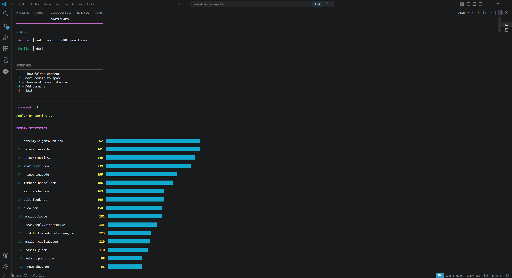

# Gmail Automation Tool

Personal CLI project to reduce spam management effort in a real Gmail inbox.

This was built as a learning project from scratch while learning IMAP basics,
email headers, and UID-based mailbox operations.

## Project Goal

The goal was to solve one concrete personal problem:
too many recurring spam/promotional emails from the same domains.

This project is intentionally scoped for single-user local usage, not as a
general multi-user production product.

## Features

- Connects to Gmail over IMAP
- Fetches email headers by UID
- Extracts sender domains
- Shows domain frequency statistics
- Moves emails from configured domains to spam in bulk
- Keeps local credentials out of Git
- Avoids duplicate domain entries in the local blocklist
- Handles invalid folder selection input more safely

## Requirements

- Python 3.10+
- Gmail account
- IMAP enabled in Gmail
- Google App Password

## Setup

```bash
git clone https://github.com/antoniomontiljo882-max/Gmail-client.git
cd Gmail-client
pip install -r requirements.txt
```

Create a local `.env` file:

```env
EMAIL_USER=your_email@gmail.com
EMAIL_PASS=your_google_app_password
```

You can copy the structure from `.env.example`.

## Run

```bash
python main.py
```

## Impact (Personal Workflow)

- Reduced repetitive manual inbox cleanup
- Faster handling of recurring sender domains
- Reusable local blocklist for recurring spam sources

## Screenshots




## Project Structure

- `main.py` - CLI entry point and menu flow
- `services/` - IMAP operations
- `UI/` - terminal display and email transformation
- `UTILS/` - helper functions and terminal colors
- `txt_files/domains_adresses.txt` - domains used for bulk actions

## Performance Notes

- Uses IMAP UIDs instead of sequence numbers for stable operations
- Fetches email data in chunks to avoid oversized IMAP responses
- Fetches only needed header fields where possible
- Uses mailbox metadata for inbox counts instead of searching every UID
- Expunges once after bulk moves instead of after every sender batch

## What I Learned

- How IMAP folders, search, and UID-based operations work
- Why selective header fetching matters for performance
- How to structure a CLI project into `services`, `UI`, and `UTILS`
- How environment variables help keep credentials out of source control

## Notes

This tool is intended for local use with real Gmail data. Do not commit `.env`
or app passwords.

## If I Continue This Project

- Add rule-based automation
- Add structured logging
- Add pagination for very large folder views
- Add tests around domain extraction and IMAP response parsing
